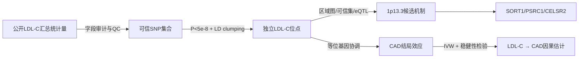

# 课程项目：从 LDL-C GWAS 到冠心病机制

> 一句话任务：从公开 LDL-C GWAS 汇总统计量出发，完成数据审计、质控、全基因组信号复现、独立位点筛选、1p13.3/SORT1 位点解释，并用两样本孟德尔随机化检验 LDL-C 对冠心病风险的因果效应。
>
> 可信边界：这是“汇总统计量再分析”，不是从个体基因型和表型重新跑一次 GWAS；后者通常需要受控数据、伦理审批和更大计算资源。

## 1. 一眼结论

| 项目 | 设计 |
|---|---|
| 生物学问题 | 常见遗传变异如何影响 LDL-C？1p13.3 信号是否支持肝脏 SORT1 通路？遗传性升高 LDL-C 是否增加 CAD 风险？ |
| 主暴露数据 | GLGC 2013 LDL-C，约 56 MB 压缩文件，hg19，适合初学者完整读取 |
| 验证数据 | GLGC 2021 欧洲祖源或跨祖源 LDL-C；文件约 2.1–2.5 GB，可只做指定区域或使用发布的可信集 |
| 结局数据 | OpenGWAS `ieu-a-7`，CARDIoGRAMplusC4D 2015，60,801 病例、123,504 对照，hg19 |
| 主工具 | R、data.table、qqman/CMplot、PLINK 1.9/2.0、TwoSampleMR；FUMA 或 VEP 任选其一 |
| 建议周期 | 10–14 天，约 20–30 小时 |
| 核心交付 | 可复现脚本、数据字典/QC日志、6张主图、结果表、1500–2500字报告 |

最重要的学习目标不是得到一个“显著结果”，而是能解释每一步改变了什么、效应等位基因如何保持一致、LD参考人群为何必须匹配，以及关联、共定位和因果推断分别能回答什么。

## 2. 生物学背景与入门框架

这个领域一直在回答同一个问题：怎样把“某个位点与性状相关”逐步缩小为“某个变异通过特定组织中的某个基因改变疾病风险”。LDL-C 是一个很好的练习对象，因为它既有清晰的定量表型，也有成熟的疾病终点 CAD；1p13.3 位点又能把 GWAS、LD、肝脏调控、SORT1 和疾病机制串起来 [E2–E4]。

枢纽节点有四个：

1. **效应等位基因与数据协调**：所有下游效应方向都依赖它；A1/A2 颠倒会直接反转 MR 结论。
2. **LD 与独立位点**：显著 SNP 不等于独立发现；clumping、条件分析和精细定位都在处理相关变异。
3. **1p13.3/SORT1**：早期 LDL GWAS 发现该区域，随后功能研究把统计信号连接到肝脏脂蛋白输出 [E2, E3]。
4. **两样本 MR**：把 LDL-C GWAS 的独立位点作为工具变量，连接 CAD GWAS，并用敏感性分析审查多效性 [E5]。



## 3. 任务书

### 阶段 0：建立项目与预注册式问题（0.5 天）

创建目录：

```text
gwas_ldl_cad/
├── README.md
├── data_raw/
├── data_clean/
├── scripts/
├── results/tables/
├── results/figures/
└── logs/
```

在 `README.md` 先写下：主问题、主数据集、基因组版本、效应等位基因定义、主要阈值和计划的敏感性分析。不要等看到结果后再改主要阈值。

**验收物**：`README.md` 和一张数据清单，包含来源 URL、下载日期、原论文、祖源、样本量、基因组版本、表型单位、许可/使用条款和文件校验值。

### 阶段 1：下载并登记 LDL-C GWAS（0.5 天）

推荐主数据为 GLGC 2013：

```bash
curl -L -o data_raw/jointGwasMc_LDL.txt.gz \
  http://csg.sph.umich.edu/willer/public/lipids2013/jointGwasMc_LDL.txt.gz
```

官方页面说明其列为 `SNP_hg18, SNP_hg19, rsid, A1, A2, Beta, SE, N, P-value, Freq.A1.1000G.EUR`；A1 是效应等位基因，坐标含 hg19。不要把 1000G EUR 的 A1 频率误当作原始研究样本频率。

记录校验值：

```bash
sha256sum data_raw/jointGwasMc_LDL.txt.gz > logs/checksums.sha256
```

Windows PowerShell 可用：

```powershell
Get-FileHash data_raw\jointGwasMc_LDL.txt.gz -Algorithm SHA256 |
  Format-List | Out-File logs\checksums.txt
```

**验收物**：原始压缩文件、数据字典 `data_raw/metadata.tsv`、校验值。

### 阶段 2：数据审计与标准化（1 天）

用 R 读取：

```r
library(data.table)
g <- fread("data_raw/jointGwasMc_LDL.txt.gz")
names(g)
dim(g)
head(g)
summary(g)
```

建立标准字段：`chr, pos, rsid, effect_allele, other_allele, beta, se, n, p, eaf_ref`。从 `SNP_hg19` 拆出染色体和位置，明确输出仍为 hg19/GRCh37。

必须逐项检查并写入 `logs/qc_report.tsv`：

- 必需字段是否存在；行数和唯一 rsID 数。
- `p` 是否满足 `0 < p <= 1`；`se > 0`；`n > 0`。
- 等位基因是否只含 A/C/G/T；是否有相同等位基因、重复 rsID、重复 chr:pos。
- 缺失值比例；各染色体 SNP 数；N 的分布。
- `beta / se` 计算的 Z 与 P 值是否大体一致：`2*pnorm(-abs(beta/se))`。
- 回文 SNP（A/T、C/G）数量；此时先标记，不要在普通 GWAS 作图中一律删除。真正需要谨慎处理的是跨数据集协调。

建议保留两个对象：

- `g_all`：只移除明显非法或重复记录，用于全基因组展示。
- `g_mr`：为 MR 准备的严格集合，要求 rsID、beta、SE、双等位 SNP、可靠频率与样本量。

**验收物**：`data_clean/ldl_glgc2013_hg19.tsv.gz`、`logs/qc_report.tsv`、一页 QC 说明。

### 阶段 3：复现全基因组关联图景（1 天）

计算并绘制：

1. Manhattan plot，标出 `P=5e-8`。
2. QQ plot。
3. Lambda GC：`median(qchisq(1-p,1))/qchisq(0.5,1)`。
4. 样本量 N 的直方图。
5. 每条染色体的显著 SNP 数量。

解释时必须区分：lambda 偏大可能来自群体分层，也可能来自强多基因性与大样本量；仅凭 QQ 图不能判断是哪一种。LDSC 能进一步把截距与多基因信号分开 [E6]，但本任务把 LDSC 设为加分项。

**验收问题**：最强峰在哪里？1p13.3 是否出现？QQ 图何时开始偏离零假设？数据中有多少 genome-wide significant SNP？

### 阶段 4：获得近似独立的 lead SNP（1 天）

先筛选 `p < 5e-8`，再用与研究祖源匹配的 1000 Genomes EUR LD 参考做 clumping。推荐参数：

```bash
plink --bfile 1000G_EUR \
  --clump data_clean/ldl_for_plink.tsv \
  --clump-snp-field rsid \
  --clump-field p \
  --clump-p1 5e-8 \
  --clump-r2 0.001 \
  --clump-kb 10000 \
  --out results/tables/ldl_leads
```

注意：这得到的是“LD 近似独立工具变量”，不是证明每个位点只有一个因果变异。对 lead SNP 计算工具强度 `F=(beta/se)^2`，主 MR 集合要求 `F>10`。

**验收物**：`lead_snps.tsv`，至少含 rsID、chr、pos、EA/OA、beta、SE、P、EAF、F、最近基因（最近基因只能叫“映射基因”，不能叫因果基因）。

### 阶段 5：深挖 1p13.3/SORT1 区域（2 天）

以 chr1:109.5–110.5 Mb（hg19；可根据主峰适当扩大）为窗口：

- 绘制区域关联图：横轴位置，纵轴 `-log10(P)`，用 1000G EUR LD 给点着色。
- 报告 lead SNP、候选基因 SORT1/PSRC1/CELSR2、该区域显著 SNP 数及其 LD 结构。
- 从 GLGC 2021 官方 `LDL_95prct_cred_set.tar.gz` 中查找该位点的 95% 可信集，与 2013 lead SNP 比较。
- 用 Ensembl VEP 或 FUMA 做功能注释：变异后果、最近基因、CADD（若可得）、RegulomeDB/染色质状态（若可得）。
- 在 GTEx Portal 手工检查 lead/credible-set 变异是否是肝脏 SORT1、PSRC1 或 CELSR2 的 eQTL。

严谨表述应是：“统计关联、可信集和肝脏 eQTL 是否共同优先支持某个基因”，而不是“离 SNP 最近的基因就是致病基因”。如果做正式共定位，需取得同一基因组版本、同一区域的完整 LDL-C 与 liver eQTL summary statistics，并使用 `coloc`；只比较两个 lead SNP 是否相同不算共定位。

**验收物**：区域图、候选变异注释表、1页机制证据链。参考功能研究显示 1p13.3/SORT1 与肝脏脂蛋白输出相关，但同一区域多个基因处于 LD 块内，结论仍需保留不确定性 [E3, E4]。

### 阶段 6：两样本 MR——LDL-C 是否增加 CAD 风险（2 天）

结局采用 OpenGWAS `ieu-a-7`（CARDIoGRAMplusC4D 2015；hg19）。OpenGWAS 目前要求 JWT；登录 `https://api.opengwas.io` 获取令牌，写入用户级 `.Renviron`：

```text
OPENGWAS_JWT=你的令牌
```

不要把 JWT 写进脚本、报告或 Git 仓库。

R 工作流：

```r
library(TwoSampleMR)

exp <- read_exposure_data(
  filename = "results/tables/lead_snps.tsv",
  sep = "\t",
  snp_col = "rsid",
  beta_col = "beta",
  se_col = "se",
  effect_allele_col = "effect_allele",
  other_allele_col = "other_allele",
  eaf_col = "eaf_ref",
  pval_col = "p",
  samplesize_col = "n"
)

out <- extract_outcome_data(
  snps = exp$SNP,
  outcomes = "ieu-a-7",
  proxies = TRUE,
  rsq = 0.8
)

dat <- harmonise_data(exp, out, action = 2)
table(dat$mr_keep)

res <- mr(dat)
het <- mr_heterogeneity(dat)
pleio <- mr_pleiotropy_test(dat)
loo <- mr_leaveoneout(dat)
```

必须报告：

- 主分析 IVW；加权中位数；MR-Egger（工具数足够时）。
- 效应尺度：每 1 SD 更高 LDL-C 对 CAD 的 OR；若原 GWAS beta 是 inverse-normalized 单位，明确写“每 1 SD/标准化单位”，不要擅自换算 mg/dL。
- Cochran Q、Egger 截距、leave-one-out、单 SNP Wald ratio/森林图、散点图、漏斗图。
- 协调后剔除多少 SNP，原因是什么；特别记录无法可靠定向的高频回文 SNP。
- 样本重叠、水平多效性、赢家诅咒与祖源不匹配作为局限。

**判定规则**：方向一致、IVW 显著、稳健方法接近、Egger 截距无明显证据且 leave-one-out 不由单 SNP 驱动时，才写“支持因果效应”；不要写“证明”。既往 MR 文献可作为结果量级和方向的参照，而不是作为你结果正确的替代品 [E5]。

### 阶段 7：可选高级分析（2–4 天）

从以下任选一项，不要全部堆上：

1. **LDSC**：估计 SNP 遗传力与截距；只用 HapMap3、严格 INFO/MAF 规则，并匹配 EUR LD scores。
2. **祖源比较**：从 GLGC 2021 下载 EUR 与 EAS 的 chr1 1p13.3 区域，比较等位基因频率、效应和 LD；不要直接把跨祖源差异解释为生物机制差异。
3. **正式 coloc**：LDL-C 与 GTEx liver SORT1 eQTL 共定位；报告 PP0–PP4 与先验敏感性。
4. **复现性验证**：用 GLGC 2021 EUR 数据检查 2013 lead SNP 的方向和显著性。

## 4. 最终交付清单

必须提交：

- `README.md`：一条命令或清晰顺序可复现全流程。
- `metadata.tsv` 与 `checksums`：数据出处可追溯。
- `01_download`, `02_qc`, `03_plot`, `04_clump`, `05_locus`, `06_mr` 六个脚本。
- 表1：数据集与样本信息；表2：独立 lead SNP；表3：1p13.3 候选变异；表4：MR 主结果与敏感性结果。
- 图1 Manhattan；图2 QQ；图3 N 分布/QC；图4 1p13.3 区域图；图5 MR 散点/森林；图6 leave-one-out。
- 1500–2500字报告，按“问题—数据—方法—结果—机制解释—局限—结论”组织。

报告结论最多回答三件事：发现了哪些独立 LDL-C 信号；1p13.3 的证据更支持哪些候选机制；MR 是否支持 LDL-C 增高导致 CAD 风险上升。

## 5. 评分标准（100分）

| 模块 | 分值 | 达标标准 |
|---|---:|---|
| 数据可追溯性 | 10 | URL、日期、论文、版本、祖源、许可、checksum 完整 |
| QC 与字段理解 | 20 | 能解释 A1/A2、beta、SE、P、N、EAF、build；有异常统计与处理日志 |
| 全基因组复现 | 15 | Manhattan/QQ 正确，阈值与膨胀解释准确 |
| 独立位点 | 15 | LD参考匹配，clumping参数透明，不把 lead SNP 当因果变异 |
| 位点机制 | 15 | 1p13.3 区域图、可信集/注释/eQTL证据链完整，语言不过度 |
| MR | 20 | 等位基因协调、主估计、至少3类敏感性分析与局限完整 |
| 可复现性与表达 | 5 | 脚本编号、固定随机种子、sessionInfo、输出目录整洁 |

以下任一项属于严重错误：混用 hg19/hg38；效应等位基因方向错误；使用不匹配祖源的 LD 参考而不说明；只报告 IVW P 值；把最近基因写成已证实因果基因；把 MR 写成“证明”。

## 6. 推荐阅读与演化脉络

| 顺序 | 文献 | 用途 |
|---:|---|---|
| 1 | E1 Uffelmann et al. 2021 | 建立 GWAS→精细定位→功能注释→靶基因的整体框架 |
| 2 | E2 Sandhu et al. 2008 | 看早期 LDL-C GWAS 如何发现 1p13.3 |
| 3 | E3 Kjolby et al. 2010 | 看统计位点怎样进入肝脏脂蛋白机制实验 |
| 4 | E5 White et al. 2016 | 学习多效性背景下的脂质 MR |
| 5 | E4 Kim et al. 2023 | 看多组学和多性状如何用于药物靶点优先级 |

演化主线：2008 年的大规模扫描定位 1p13.3 [E2] → 2010 年左右开始用实验模型连接 SORT1 与肝脏脂蛋白输出 [E3] → 后续用更大样本、多祖源、精细定位、eQTL/多组学缩小候选变异和基因 [E4, E7] → MR 与跨祖源研究检验 LDL-C 到 CAD 的因果一致性 [E5, E8]。

## 7. 证据与检索透明度

| ID | 文献 | DOI | 在任务中的作用 | Query |
|---|---|---|---|---|
| E1 | Uffelmann et al. 2021, Genome-wide association studies | 10.1038/s43586-021-00056-9 | GWAS及功能跟进总框架 | q3 |
| E2 | Sandhu et al. 2008, LDL-cholesterol concentrations: a GWAS | 10.1016/S0140-6736(08)60208-1 | 早期LDL-C和1p13.3节点 | q5 |
| E3 | Kjolby et al. 2010, SORT1 and hepatic lipoprotein export | 10.1016/j.cmet.2010.08.006 | 位点到机制的关键节点 | q8 |
| E4 | Kim et al. 2023, dyslipidemia target prioritization | 10.1016/j.xcrm.2023.101112 | 多组学、SMR/HEIDI和靶点优先级 | q8 |
| E5 | White et al. 2016, lipid fractions and CAD/diabetes | 10.1001/jamacardio.2016.1884 | MR设计与结果参照 | q4 |
| E6 | Barry et al. 2022, heritability guide | 10.1093/ije/dyac224 | LDSC截距与遗传力解释 | q7 |
| E7 | Hodonsky et al. 2024, multi-ancestry gene regulation | 10.1016/j.xgen.2023.100465 | 多祖源调控整合前沿 | q9 |
| E8 | Urbut et al. 2025, cholesterol and CAD across ancestries | 10.1056/EVIDoa2500105 | 跨祖源LDL-C/CAD一致性 | q9 |

本次检索共 9 个 query，每个返回 5 条，共 45 条。文献筛选服务于课程设计而非系统综述；某些查询（尤其 q2、q6）精确度一般，因此没有把所有返回文献写入结论。概念和脉络中的“枢纽节点”是本次检索的交叉结果，不是权威分类。

